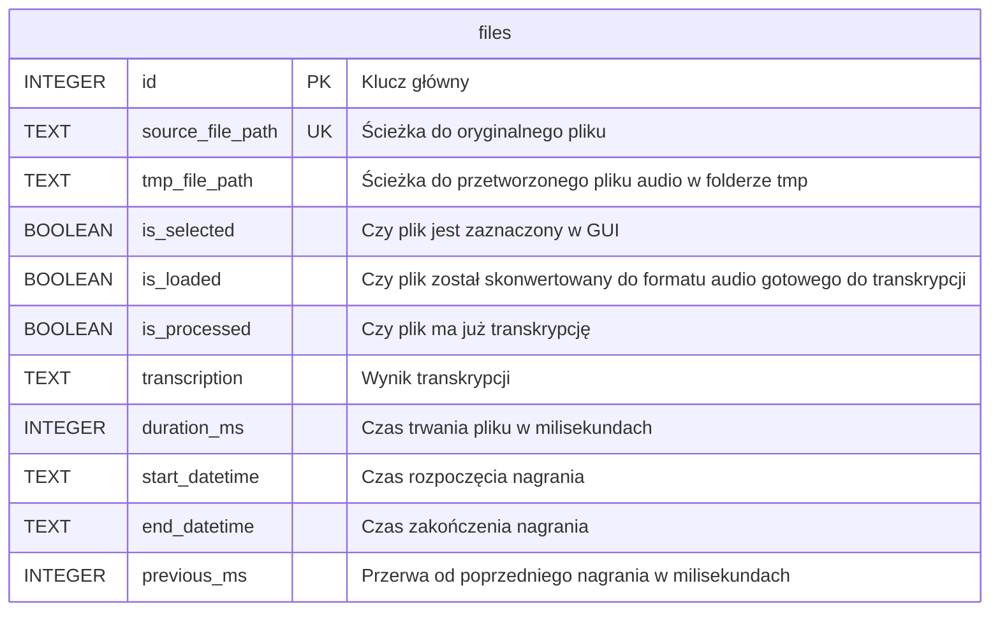
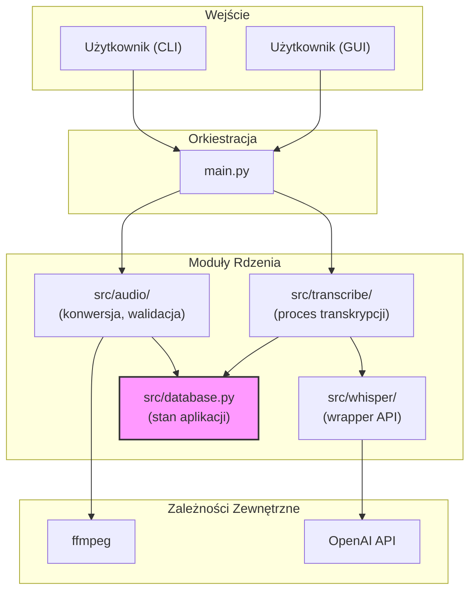
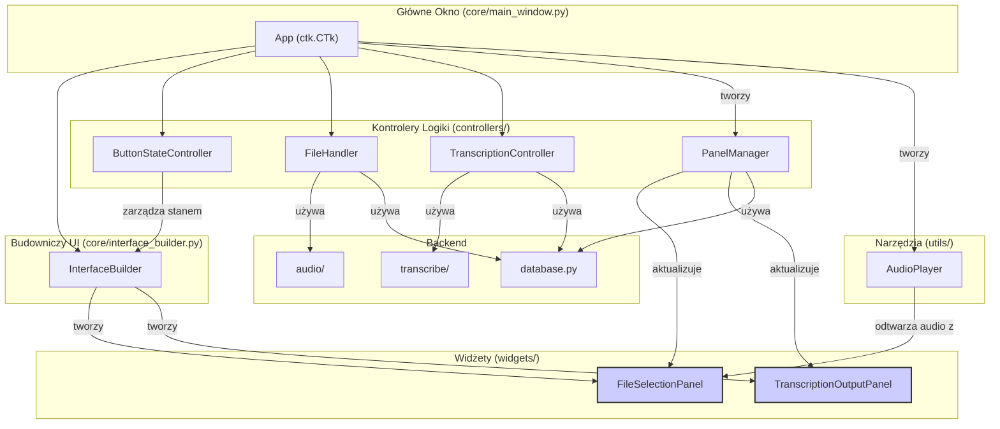

# Aplikacja do Transkrypcji Notatek Głosowych

Ta aplikacja służy do automatycznej transkrypcji plików audio przy użyciu API OpenAI Whisper. Projekt został napisany z myślą o modułowości i czytelności kodu, oferując zarówno interfejs graficzny (GUI), jak i tradycyjny tryb wiersza poleceń (CLI).

## Kluczowe Funkcje

*   **Dwa tryby pracy:** Interaktywny interfejs graficzny (GUI) lub szybki tryb wiersza poleceń (CLI).
*   **Zarządzanie stanem:** Aplikacja używa bazy danych SQLite do zapisywania stanu plików, co pozwala na wstrzymywanie i wznawianie pracy.
*   **Konwersja w locie:** Automatycznie konwertuje różne formaty audio (np. `.mp3`, `.m4a`) do zoptymalizowanego formatu audio za pomocą `ffmpeg`.
*   **Przetwarzanie w tle:** W trybie GUI wszystkie zasobochłonne zadania (konwersja, transkrypcja) są wykonywane w osobnych wątkach, co zapobiega "zamrażaniu" interfejsu.

## Wymagania

*   Python 3.x
*   `ffmpeg` - musi być zainstalowany i dostępny w ścieżce systemowej (PATH).
*   Klucz API do OpenAI - zapisany w pliku `.env`.

## Instalacja

1.  **Sklonuj repozytorium:**
    ```bash
    git clone <adres-repozytorium>
    ```
    ```bash
    cd <nazwa-repozytorium>
    ```

2.  **Utwórz i aktywuj wirtualne środowisko:**
    *   Dla macOS/Linux:
        ```bash
        python3 -m venv .venv
        ```
        ```bash
        source .venv/bin/activate
        ```
    *   Dla Windows:
        ```bash
        python -m venv .venv
        ```
        ```bash
        .venv\Scripts\activate
        ```

3.  **Zainstaluj zależności:**
    ```bash
    pip install -r requirements.txt
    ```

4.  **Skonfiguruj klucz API:**
    *   Utwórz plik o nazwie `.env` w głównym katalogu projektu.
    *   W pliku `.env` dodaj swój klucz API w następującym formacie:
        ```
        API_KEY_WHISPER="sk-xxxxxxxxxxxxxxxxxxxxxxxxxxxxxxxx"
        ```

## Jak używać?

Aplikację można uruchomić w dwóch trybach.

### Tryb graficzny (GUI) - zalecany

Tryb graficzny zapewnia interaktywną obsługę i wizualizację całego procesu.

1.  **Uruchom aplikację** z flagą `--gui`:
    ```bash
    python main.py --gui
    ```
2.  **Postępuj zgodnie z instrukcjami** na ekranie:
    *   Kliknij "Wybierz pliki", aby dodać pliki audio.
    *   Zaznacz pliki, które chcesz przetworzyć.
    *   Kliknij "Wczytaj Pliki", aby przekonwertować je do formatu audio gotowego do transkrypcji.
    *   Kliknij "Start", aby rozpocząć proces transkrypcji.

#### Ułatwione uruchamianie w Windows

Aby uruchomić aplikację jednym kliknięciem (bez potrzeby ręcznego aktywowania środowiska wirtualnego i bez widocznego okna terminala), możesz użyć dołączonych skryptów.

1.  **Utwórz skrót:** Kliknij prawym przyciskiem myszy na plik **`run_silent.vbs`** (nie `run_gui.bat`) i wybierz `Utwórz skrót`.
2.  **(Opcjonalnie) Zmień ikonę:** Kliknij prawym przyciskiem na nowo utworzony skrót, wybierz `Właściwości` -> `Zmień ikonę...` i wybierz dowolną ikonę.
3.  **Przenieś skrót** na pulpit lub w inne dogodne miejsce.

### Tryb wiersza poleceń (CLI)

Tryb CLI służy do szybkiego przetwarzania plików z jednego folderu.

1.  **Uruchom aplikację**, podając ścieżkę do folderu z plikami audio za pomocą flagi `--input-dir`:
    ```bash
    python main.py --input-dir /sciezka/do/twoich/plikow
    ```
    *Aplikacja rekursywnie przeszuka cały podany folder i jego podfoldery.*

2.  **Opcjonalnie**, jeśli chcesz przetwarzać pliki dłuższe niż 5 minut, dodaj flagę `-l` lub `--allow-long`:
    ```bash
    python main.py --input-dir /sciezka/do/plikow --allow-long
    ```

3.  **Gotowe!** Po zakończeniu procesu, wszystkie transkrypcje zostaną zapisane w bazie danych w folderze `tmp/`.

## Architektura Aplikacji

Poniższe schematy ilustrują budowę i przepływ danych w aplikacji.

### Schemat Bazy Danych

Aplikacja używa pojedynczej tabeli `files` w bazie SQLite do śledzenia stanu każdego pliku audio w procesie.



### Przepływ Danych (Logika Backendu)

Diagram pokazuje, jak poszczególne moduły współpracują ze sobą w celu przetworzenia plików audio.



### Struktura Interfejsu Graficznego (GUI)

Diagram przedstawia relacje między kluczowymi klasami odpowiedzialnymi za budowę i logikę interfejsu użytkownika.



## Zarządzanie Zależnościami

Aby upewnić się, że korzystasz z najnowszych wersji bibliotek, możesz okresowo je aktualizować.

1.  **Sprawdź dostępne aktualizacje:**
    ```bash
    pip list --outdated
    ```

2.  **Zaktualizuj biblioteki:**
    ```bash
    pip install --upgrade -r requirements.txt
    ```

3.  **Zapisz nowe wersje w pliku:**
    Po aktualizacji, wygeneruj nowy plik `requirements.txt`, aby zapisać zmiany.
    ```bash
    pip freeze > requirements.txt
    ```

## Struktura projektu

*   `main.py`: Główny plik uruchomieniowy, który parsuje argumenty i uruchamia odpowiedni tryb (CLI/GUI).
*   `src/`: Główny folder z kodem źródłowym aplikacji.
    *   `config.py`: Centralny plik konfiguracyjny (ścieżki, parametry API).
    *   `database.py`: Moduł do zarządzania bazą danych SQLite.
    *   `audio/`: Moduł do operacji na plikach audio (wyszukiwanie, konwersja, sprawdzanie długości).
    *   `transcribe/`: Moduł zarządzający procesem transkrypcji.
    *   `whisper/`: Moduł będący "opakowaniem" (wrapperem) dla API OpenAI Whisper.
    *   `gui/`: Moduł zawierający cały kod interfejsu graficznego.
        *   `core/`: Główne okno aplikacji i "budowniczy" interfejsu.
        *   `controllers/`: Klasy zarządzające logiką GUI (np. stanem przycisków, obsługą plików).
        *   `widgets/`: Niestandardowe komponenty GUI (np. panele list plików).
        *   `utils/`: Narzędzia pomocnicze dla GUI (np. odtwarzacz audio).
*   `tmp/`: Folder na wszystkie pliki robocze (baza danych, przetworzone pliki audio).
*   


## Uwagi techniczne

- Próbowałem przejść na bibliotekę  pydub oraz PyAV, aby uniezależnić się od instalacji ffmpeg w systemie ale były ciągłe problemy i jest to gałąź martwa, ale zostawiłem.
- Jest też ponoć jakaś biblioteka ffmpeg, która jest statyczna i można ją całą zaimportować do projektu i dzięki temu nie trzeba nic instalować w systemie i waży ok. 50 MB
- Teraz jak rozumiem pydub wykorzystujemy jako wrapper dla ffmpeg i ffplay?
- Maksymalna wersja Python to 3.12 ponieważ to ostatnia wersja z audioop, w 3.13 nie ma tego modułu i trzeba instalować audioop-lts

## Architektura Audio - Decyzje Techniczne

### Obecne Rozwiązanie (subprocess + FFmpeg/ffplay)

**Stan na dzień:** bezpośrednie wywoływanie `ffmpeg` i `ffplay` przez `subprocess` bez wrapperów.

**Zalety obecnego podejścia:**
- ✅ Proste i niezawodne - działa stabilnie od dłuższego czasu
- ✅ Pełna kontrola nad parametrami FFmpeg/ffplay (opóźnienie, formaty, optymalizacje)
- ✅ Brak dodatkowych zależności Python - tylko zewnętrzny FFmpeg w systemie
- ✅ Łatwe debugowanie - widoczne są dokładne komendy wywoływane w logach

**Wady obecnego podejścia:**
- ❌ Zależność od systemu - wymaga zainstalowanego FFmpeg w PATH
- ❌ Brak abstrakcji - kod związany z składnią komend tekstowych
- ❌ Ograniczone bezpieczeństwo - użycie `shell=True` w subprocess
- ❌ Własna obsługa błędów, timeout'ów i stanów procesów
- ❌ Brak prawdziwej pauzy w odtwarzaczu (tylko stop/play)

**Decyzja:** Pozostajemy przy obecnym rozwiązaniu, ponieważ:
- Narzędzie działa stabilnie i spełnia wszystkie wymagania
- Zespół jest mały (1 osoba), więc złożoność wrapperów nie jest potrzebna
- Zmiana wiązałaby się z ryzykiem wprowadzenia błędów
- Obecne rozwiązanie jest wystarczająco wydajne dla potrzeb aplikacji

### Przyszłe Opcje Wrapperów - Analiza

#### 1. **ffmpeg-python** (dla konwersji audio)
```python
# Zamiast: subprocess.run(f'ffmpeg -i input.mp3 output.wav')
ffmpeg.input('input.mp3').output('output.wav').run()
```

**Zalety:**
- Pythonowe API zamiast stringów komend
- Lepsza obsługa błędów i walidacja parametrów
- Łatwiejsze testowanie i debugowanie
- Możliwość programistycznego budowania złożonych komend

**Wady:**
- Wymaga zewnętrznego FFmpeg (jak obecnie)
- Dodatkowa zależność Python
- Krzywa nauki dla złożonych operacji

**Rekomendacja:** Najlepsza opcja jeśli zdecydujemy się na zmianę konwersji audio.

#### 2. **ffpyplayer** (dla odtwarzania audio)
```python
# Zamiast subprocess.Popen(['ffplay', ...])
from ffpyplayer.player import MediaPlayer
player = MediaPlayer(file_path)
player.toggle_pause()  # prawdziwa pauza!
```

**Zalety:**
- Bezpośredni wrapper dla ffplay - zachowuje wszystkie optymalizacje
- Dodaje prawdziwą pauzę (brak w obecnym rozwiązaniu)
- Lepsza kontrola głośności, pozycji, stanów
- Pythonowe API dla wszystkich parametrów ffplay

**Wady:**
- Wymaga zewnętrznego FFmpeg
- Mniej popularne, mniej przykładów i wsparcia
- Złożone API (wymaga zrozumienia pętli odtwarzania)

**Rekomendacja:** Najlepsza opcja jeśli potrzebna będzie prawdziwa pauza lub lepsze zarządzanie odtwarzaniem.

#### 3. **PyAV (AvPy)** (kompletny zamiennik FFmpeg)
```python
# Bezpośredni dostęp do funkcji FFmpeg bez zewnętrznych narzędzi
import av
container = av.open(file_path)
# Pełna kontrola nad dekodowaniem i konwersją
```

**Zalety:**
- Może działać bez zewnętrznego FFmpeg (statyczna kompilacja ~50MB)
- Największa kontrola i wydajność
- Uniezależnienie od systemu

**Wady:**
- Bardzo złożone API - stroma krzywa nauki
- Problemy z kompilacją na różnych systemach
- Wymaga głębokiej wiedzy o multimedia

**Rekomendacja:** Dla przyszłego rozwoju jeśli aplikacja urośnie i będzie potrzebna niezależność od systemu.

#### 4. **Pydub + playsound** (proste rozwiązanie)
```python
from pydub import AudioSegment
from playsound import playsound

# Konwersja
sound = AudioSegment.from_file('input.mp3')
sound.export('output.wav')

# Odtwarzanie  
playsound('output.wav', block=False)
```

**Zalety:**
- Bardzo proste API
- Brak zależności od FFmpeg dla odtwarzania
- Łatwe do prototypowania

**Wady:**
- Mniej formatów audio niż FFmpeg
- Brak kontroli nad parametrami odtwarzania (opóźnienie, buforowanie)
- Wolniejsze dla dużych plików

**Rekomendacja:** Dla prostych zastosowań lub prototypów, nie dla produkcyjnego użycia z wieloma formatami.

### Plan na Przyszłość

**Kiedy rozważyć zmianę:**
- Gdy aplikacja będzie miała wielu użytkowników (łatwiejsza instalacja bez FFmpeg)
- Gdy potrzebna będzie prawdziwa pauza w odtwarzaczu
- Gdy zespół się powiększy (łatwiejsze utrzymanie kodu z wrapperami)
- Gdy pojawią się problemy z bezpieczeństwem subprocess

**Priorytet zmian:**
1. **ffpyplayer** dla odtwarzania (prawdziwa pauza, lepsze API)
2. **ffmpeg-python** dla konwersji (czytelniejszy kod)
3. **PyAV** dla niezależności od systemu (długoterminowo)

**Migracja stopniowa:**
- Zacząć od odtwarzania (ffpyplayer) - mniejsze ryzyko
- Potem konwersja (ffmpeg-python) - większa korzyść dla czytelności
- Na końcu rozważyć PyAV jeśli potrzebne uniezależnienie